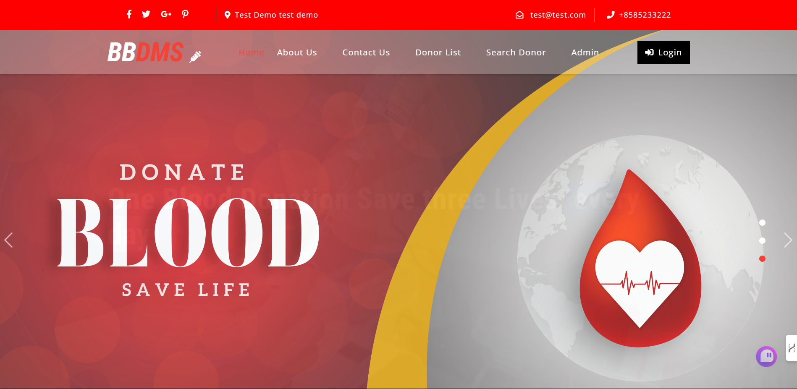
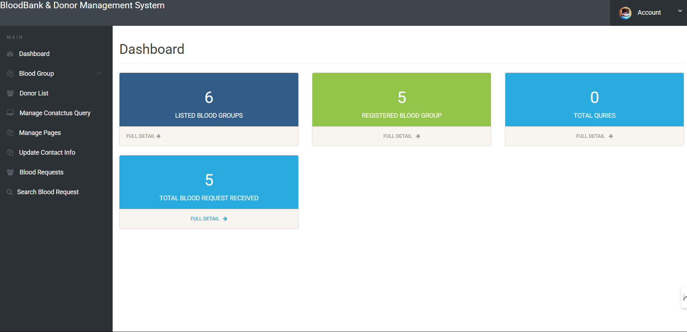
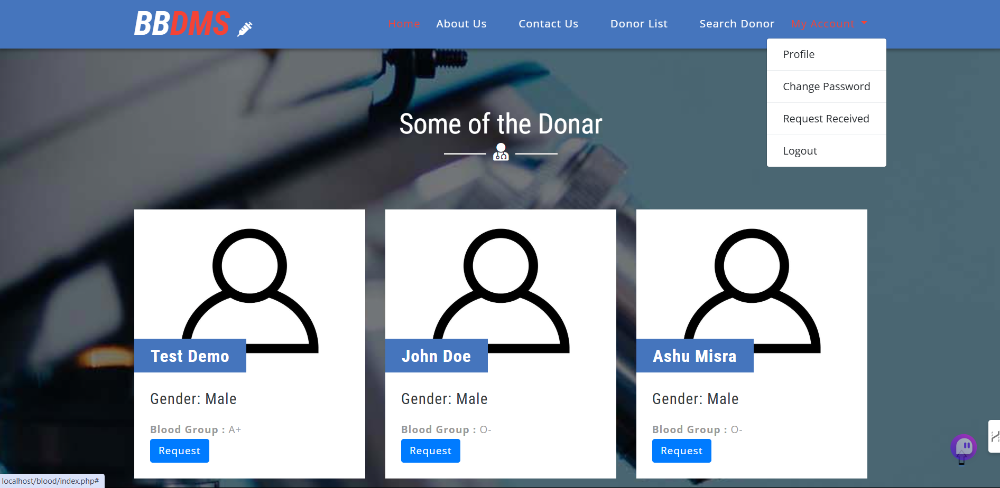

# Blood Bank & Donor Management System

A web-based application developed using PHP and MySQL that allows users to donate blood, search for blood donors, and manage donor and blood bank information.

## Features

### Admin Module:
- **Dashboard**: View all details like total blood groups listed, registered donors, and total inquiries.
- **Manage Blood Groups**: Admin can add or delete blood groups.
- **Donor List**: Admin can view and manage the list of donors.
- **Manage Contact Us Queries**: View and manage queries from users.
- **Manage Pages**: Admin can update website pages.
- **Update Contact Information**: Admin can update contact details of the website.
- **Request Received by Donor**: Admin can view the requests for blood donation.

### User Module:
- **Home**: Welcome page for users and donors.
- **About Us**: View the about us page.
- **Contact Us**: Users can contact admin through this page.
- **Donor List**: View and contact donors.
- **Search Donor**: Users can search for donors by city and blood group.

### Donor Module:
- **Home**: Welcome page for users and donors.
- **My Account**: Donors can manage their profile, change password, and view received requests.

## Installation Guide

1. **Download**: Download the project zip file.
2. **Extract**: Extract the file and copy the `bbdms` folder.
3. **Move to the Web Server**:
    - For XAMPP: `xampp/htdocs`
    - For WAMP: `wamp/www`
    - For LAMP: `var/www/html`
4. **Set up the Database**:
    - Open `phpMyAdmin` at `http://localhost/phpmyadmin`.
    - Create a database named `bbdms`.
    - Import the `bbdms.sql` file located in the SQL folder.
5. **Access the Application**: Run the application at `http://localhost/bbdms`.

## Admin Login Credentials
- **Username**: `admin`
- **Password**: `12345`

## Donor Login Credentials
register a new user.

## Technologies Used
- **Frontend**: HTML, CSS, JavaScript, AJAX, jQuery
- **Backend**: PHP (5.6, 7.x, 8.x)
- **Database**: MySQL (5.x, 8.x)
- **Web Browser Compatibility**: Mozilla, Google Chrome, IE8, Opera

## Requirements
- XAMPP, WAMP, MAMP, or LAMP

## Screenshots
1. **Home Page**  
   

2. **Admin Dashboard**  
   

3. **Patient Login**  
   

## License
This project is licensed under the MIT License.

## Author
Vivek Dubey
[Instagram](https://www.instagram.com/vivekkkkk_2.o/)
